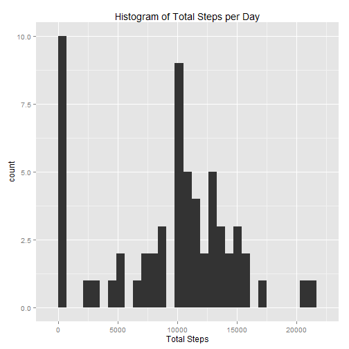
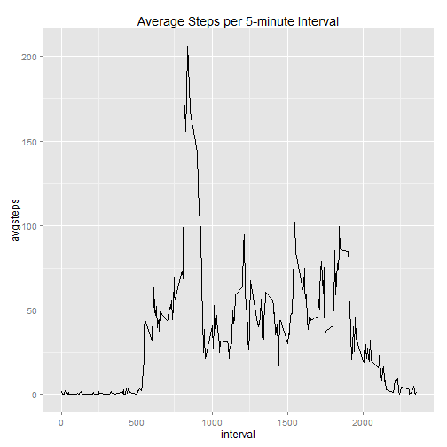
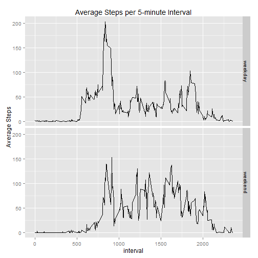

# Reproducible Research - Peer Assessment 1  
This assignment makes use of data from a personal activity monitoring device. The device collects data at 5 minutes intervals throughout the day. The data consists of two months of data from an anonymous individual collected during the months of October and November 2012 and include the number of steps taken in 5 minutes interval each day.


## Loading and preprocessing the data

```r
act <- read.csv('activity.csv')
summary(act)
```

```
##      steps                date          interval     
##  Min.   :  0.00   2012-10-01:  288   Min.   :   0.0  
##  1st Qu.:  0.00   2012-10-02:  288   1st Qu.: 588.8  
##  Median :  0.00   2012-10-03:  288   Median :1177.5  
##  Mean   : 37.38   2012-10-04:  288   Mean   :1177.5  
##  3rd Qu.: 12.00   2012-10-05:  288   3rd Qu.:1766.2  
##  Max.   :806.00   2012-10-06:  288   Max.   :2355.0  
##  NA's   :2304     (Other)   :15840
```


## What is mean total number of steps taken per day?

```r
require(dplyr)
```

```
## Loading required package: dplyr
## 
## Attaching package: 'dplyr'
## 
## The following objects are masked from 'package:stats':
## 
##     filter, lag
## 
## The following objects are masked from 'package:base':
## 
##     intersect, setdiff, setequal, union
```

```r
# compute total steps per day
aggdata <- act %>% 
            group_by(date) %>% 
            summarise(totalsteps = sum(steps, na.rm=TRUE))
 

# plot histogram of total steps per day
require(ggplot2)
```

```
## Loading required package: ggplot2
```

```r
ggplot(aggdata) + 
        geom_histogram(aes(x=round(totalsteps)),binwidth=700) +
        ggtitle("Histogram of Total Steps per Day") +
        xlab("Total Steps")
```

 

```r
# mean number of steps per day
mean(aggdata$totalsteps)
```

```
## [1] 9354.23
```

```r
# median number of steps per data
median(round(aggdata$totalsteps))
```

```
## [1] 10395
```


## What is the average daily activity pattern?


```r
# get average steps per 5 minute interval
avg <- act %>% 
            group_by(interval) %>% 
            summarise(avgsteps = mean(steps, na.rm=TRUE))

# plot graph of steps vs. 5-minute interval
ggplot(avg) + 
    geom_line(aes(x=interval,y=avgsteps)) +
    ggtitle("Average Steps per 5-minute Interval")
```

 

```r
# find 5-minute interval with most steps
idx <- which.max(avg$avgsteps)
avg[idx,1]
```

```
## Source: local data frame [1 x 1]
## 
##   interval
## 1      835
```


## Imputing missing values


```r
# number of rows with missing data
sum(is.na(act$steps))
```

```
## [1] 2304
```

```r
# function to replace each day's NA with daily average
updateNa <- function(x) {
    
    df <- x %>%                             # compute average steps per day
        group_by(date) %>% 
        summarize(avg = mean(steps, na.rm=TRUE))
    
    n <- length(df$date)
    
    # separate data in NA and non-NA
    x1 <- x %>% filter(!is.na(steps))
    x2 <- x %>% filter(is.na(steps))
    
    # update NAs with averages steps for that day
    m <- length(x2$date)
 
    for (j in 1:m) {
        date <- x2[j,2]
        idx <- which(df$date == date)       # get index for date in summary dataframe
        avg <- df$avgsteps[idx]
        avg <- ifelse(is.null(avg),0,avg)   # get average steps for that date
        
        x2[j,1] <- avg                      # replace NA with average steps for that day
    }
    
    x <- rbind(x1, x2)
    x <- x %>% arrange(date,interval)
    return(x)
}

# create new dataset with NA replaced with daily average
act2 <- updateNa(act)

# verify there are no NAs in new dataset
summary(act2)
```

```
##      steps                date          interval     
##  Min.   :  0.00   2012-10-01:  288   Min.   :   0.0  
##  1st Qu.:  0.00   2012-10-02:  288   1st Qu.: 588.8  
##  Median :  0.00   2012-10-03:  288   Median :1177.5  
##  Mean   : 32.48   2012-10-04:  288   Mean   :1177.5  
##  3rd Qu.:  0.00   2012-10-05:  288   3rd Qu.:1766.2  
##  Max.   :806.00   2012-10-06:  288   Max.   :2355.0  
##                   (Other)   :15840
```

```r
# compute total steps per day for new dataset
aggdata2 <- act2 %>% 
            group_by(date) %>% 
            summarise(totalsteps = sum(steps, na.rm=TRUE))
 

# plot histogram of total steps per day
ggplot(aggdata2) + 
        geom_histogram(aes(x=round(totalsteps)),binwidth=700) +
        ggtitle("Histogram of Total Steps per Day")
```

 

```r
# mean number of steps per day for new dataset
mean(aggdata2$totalsteps)
```

```
## [1] 9354.23
```

```r
# median number of steps per data for new dataset
median(round(aggdata2$totalsteps))
```

```
## [1] 10395
```
### Impact of filing in missing data
1. There was no impact on mean and median values, since both values were **not** impacted by replacing NA with the daily average values.
2. Replacing NA with the daily average had no impact on the average number of steps taken per day.

## Are there differences in activity patterns between weekdays and weekends?


```r
# function to return the type of day
getDayType <- function(x) {
    result <- "weekday"
    
    if (weekdays(as.Date(x)) %in% c("Saturday","Sunday")) {
        result <- "weekend"
    }
    return(result)
}

# add new factor to dataset to indicate weekday vs. weekend   
dayType <- sapply(act2$date, getDayType)
act2$dayType <- dayType

# find average steps per interval and type of day
avg2 <- act2 %>% 
            group_by(interval,dayType) %>% 
            summarise(avgsteps = mean(steps, na.rm=TRUE))

# plot graph of average steps per 5-minute interval
ggplot(avg2) + 
    geom_line(aes(x=interval,y=avgsteps)) +
    ggtitle("Average Steps per 5-minute Interval") +
    ylab("Average Steps") +
    facet_grid(dayType ~ .) 
```

 

